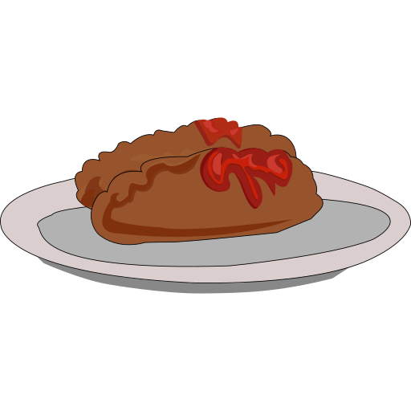
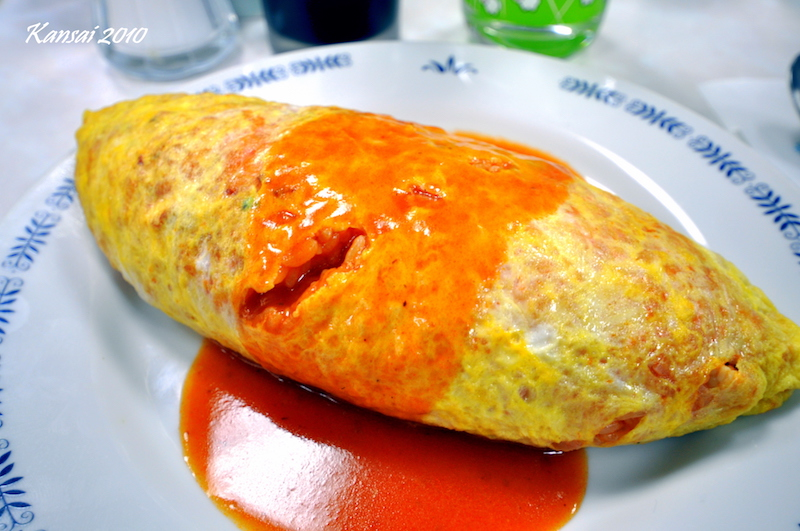
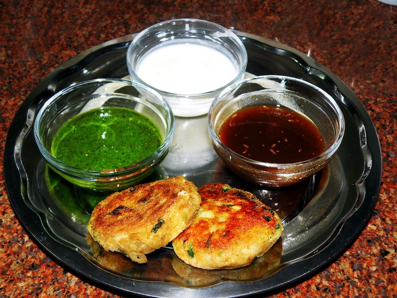

# Cutlet emoji

**Submitter:** Linas Valiukas (<linas.valiukas@gmail.com>)

**Date:** Jun 30, 2017

## Summary

I propose the image of two round blobs of foodstuff, depicting cutlets, to be added to the emoji list of the upcoming Unicode 12.0 standard.

## 1. Identification

<!-- Suggested short name and keywords for the emoji, as in the Emoji List -->

### A. CLDR short name

`cutlet`

### B. CLDR keywords

`meatballs` | `tonkatsu` | `schnitzel` | `chicken kiev` | `kotlet`

## 2. Images

<!-- A set of sample color images for the proposed emoji must be included in the proposal and in an attached zip file. These are to illustrate how each character might be displayed. The format and license must be as specified in Images. -->

### A. Zip File

Please see attached file [`cutlet-emoji-images.zip`](cutlet-emoji-images.zip).

### B. License

<!-- The proposer must certify that the images have appropriate licenses for use by the Unicode consortium, and list the type of license. -->

The cutlet emoji general concept image is own work (author can't draw really), released into public domain.

Sample images used in this proposal are licensed under Creative Commons license.

## 3. Selection Factors — Inclusion

<!-- A section that addresses all Selection Factors for Inclusion, and for each one provides evidence as to what degree each of the proposed characters would satisfy that factor. -->

### A. Compatibility

Not applicable.

### B. Expected usage level

#### 1. Frequency

Cutlets take many forms in cuisines around the world, including but not limited to:

* a generic [cutlet], a favorite dish in many Eastern European and Slavic countries, e.g. Russia

    

* [omurice], also a Japanese dish, technically not a cutlet but shares a similar look:

    

* [chicken Kiev], a cutlet of a distinctive look, popular in Ukrainian cuisine and abroad:

    .jpg; Creative Commons Attribution-Share Alike 2.0 Generic")

* [tikki], a vegetarian brother of a cutlet from Indian-Pakistani cuisine:

    

* [escalope], a French dish sharing visual similarities to the classic cutlet
* [schnitzel], a famous cutlet originating from Austria but popular around the world
* [tonkatsu] from the Japanese cuisine

Given that the cutlet has a very similar look around the world, the author expects that emoji fans from countries above will be happy to choose the proposed cutlet emoji to depict their local specialties.

Naturally, the staple American and international food such as hamburger is significantly more popular on Google Trends. However, when one compares the query `hamburger` with an incomplete list of terms the cutlet emoji is destined to depict (`schnitzel` + `chicken kiev` + `cutlet` + `котлеты` + `escalope`), the search volume for cutlets becomes more substantial, varying at around 48% popularity when compared to `hamburger`:

 vs `schnitzel + chicken kiev + cutlet + котлеты + escalope` (red line) on Google Trends")

([`hamburger` vs various forms of `cutlet` on Google Trends][google-trends-cutlet])

Similar trend could be inferred from Instagram: search for tag `hamburger` returns ~2,316,000 posts, but the combined tag count for `schnitzel` (~235,000 posts), `chickenkiev` (~11,000 posts), `cutlet` (~46,000 posts), `котлеты` (~38,000 posts) and `escalope` (~15,000 posts) comes up to ~345,000 posts, a substantial amount for what is pretty much the same dish.

#### 2. Multiple usages

With no direct and preexisting metaphors associated with cutlets known to the author, it would be hard to ignore the fact that the image of "cutlets" (essentially two round blobs) likely would not take long to earn a sexual association, similar to the now infamous `AUBERGINE (U+1F346)`.

#### 3. Use in Sequences

While emoji modifiers currently seem to be available only for some categories in the `Smileys & People` location (e.g. one can use the Fitzpatrick scale Unicode modifier to change the skin color of an emoji), the author is sure that the generic look of the cutlets emoji will allow users from different cultures to see their national dish (be it schnitzel, cutlet vulgaris or chicken Kiev) in the emoji.

In more sleazy contexts, e.g. Tinder (in which emojis are at their utmost popularity), the author anticipates that the proposed cutlet emoji might be converged with the previously mentioned aubergine (eggplant) emoji to communicate certain intentions in a subtle yet witty manner.

### C. Image distinctiveness

There is no image present in the current emoji list from the latest Unicode 11.0 standard that would depict two blobs of foodstuff.

The closest match available, `POULTRY LEG (U+1F357)`, is vastly different in both form, shape and meaning.

### D. Completeness

Not applicable.

#### E. Frequently requested

Some anecdotal evidence of users requesting the cutlet emoji online is available, e.g. on [this German language article posted in 2015][schnitzel-emoji-request].

## 4. Selection Factors — Exclusion

<!-- A section that addresses all Selection Factors for Inclusion, and for each one provides evidence as to what degree each of the proposed characters would satisfy that factor. -->

### F. Overly specific

The proposed emoji image to be added is not to be a specific type or form of the cutlet (e.g. a schnitzel), but rather should depict two blobs of foodstuff (not necessarily meat) put on a plate, thus making the proposed image very generic and universal.

### G. Open-ended

As detailed in Wikipedia pages on [cutlet] and [schnitzel], a cutlet is a broad category of dishes with a more or less similar look. Therefore, the cutlet emoji would cover the whole range of currently unrepresented dishes in various cultures.

### H. Already Representable

As mentioned previously, the image of cutlets (be this cutlet a schnitzel, a tonkatsu or tikki) could not be accurately or loosely represented with the current availability of emojis.

### I. Logos, brands, UI icons, signage, specific people, deities

Not applicable.

### J. Transient

The cutlet, or rather the concept of the cutlet (minced and cooked meat) has been around since prehistoric ages and is unlikely to go away soon.

### K. Faulty Comparison

Not applicable.

## 5. Sort location

<!-- A proposed sort location for the emoji in Emoji Ordering -->

`Food & Drink`

### A. Category

<!-- (such as cat-face) -->

`food-prepared`

### B. Emoji it should come after in that category

<!-- (such as after 🙀 WEARY CAT FACE). -->

`CANNED FOOD (U+1F96B)`

## 6. Other Information

<!-- Any other information that would be helpful, such as design considerations for images. -->

Not applicable.

<!-- -->

[tonkatsu]: https://en.wikipedia.org/wiki/Tonkatsu
[omurice]: https://en.wikipedia.org/wiki/Omurice
[schnitzel]: https://en.wikipedia.org/wiki/Schnitzel
[chicken Kiev]: https://en.wikipedia.org/wiki/Chicken_Kiev
[cutlet]: https://en.wikipedia.org/wiki/Cutlet
[tikki]: https://en.wikipedia.org/wiki/Aloo_tikki
[escalope]: https://en.wikipedia.org/wiki/Escalope
[google-trends-cutlet]: https://trends.google.com/trends/explore?q=hamburger,schnitzel%20%2B%20chicken%20kiev%20%2B%20cutlet%20%2B%20%D0%BA%D0%BE%D1%82%D0%BB%D0%B5%D1%82%D1%8B%20%2B%20escalope
[schnitzel-emoji-request]: https://www.br.de/puls/themen/netz/emoji-beschwerdebrief-zuckerberg-100.html
